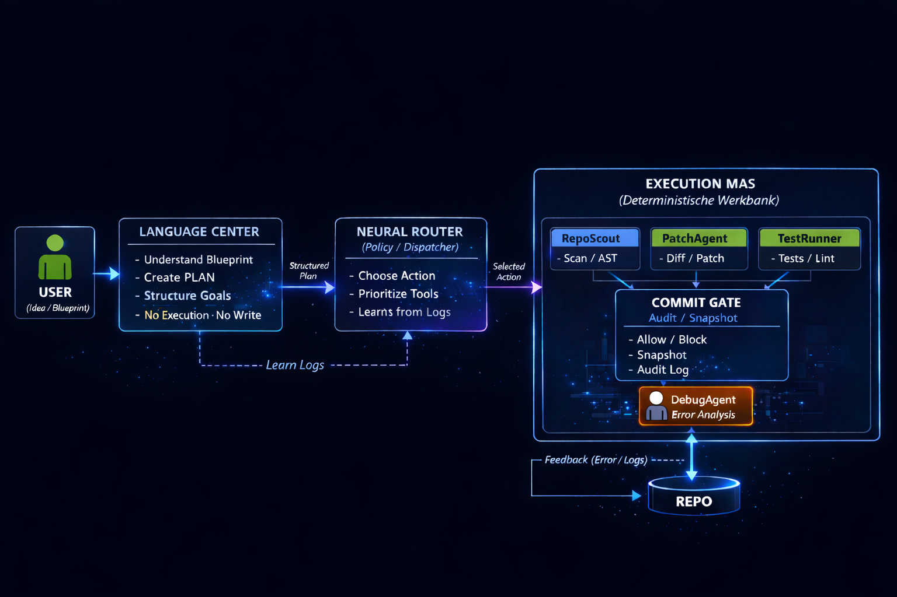
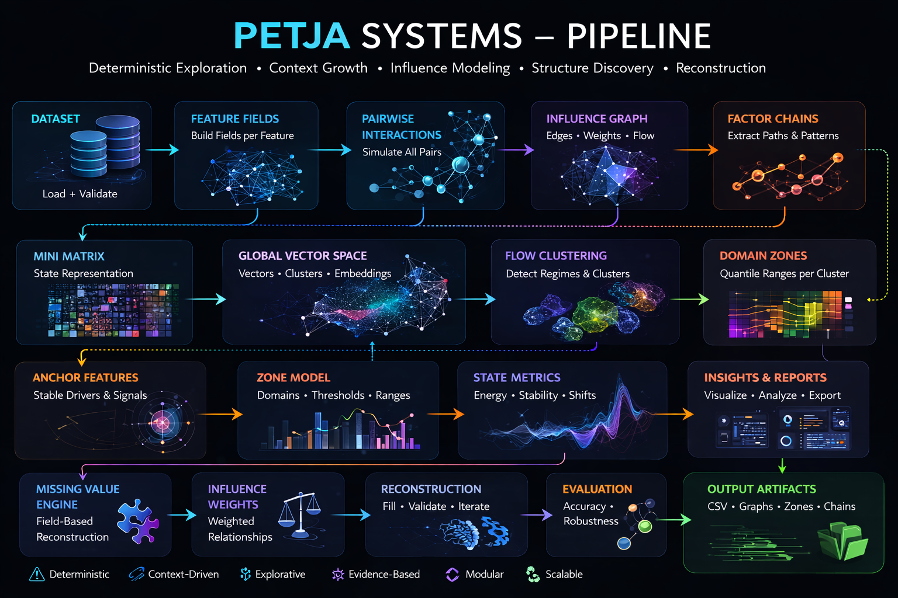
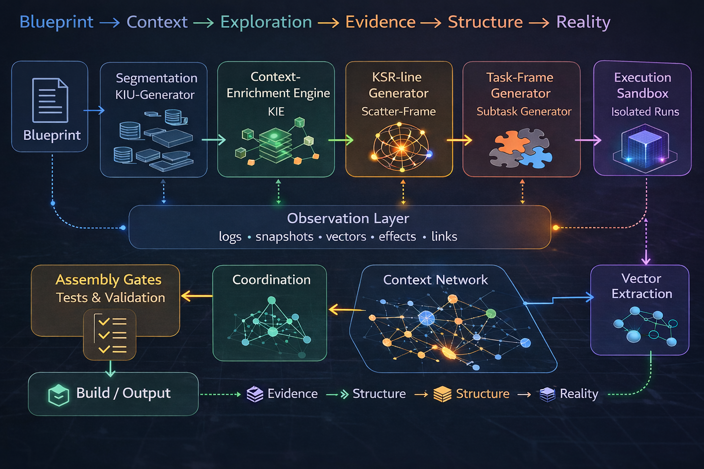

# Petja Systems

Architecture and research hub for deterministic exploration systems, context-network engines, and experimental AI infrastructure.

This repository provides an overview of a collection of experimental software systems focused on structured exploration, context-driven computation, and modular AI architectures.

The goal of these projects is to investigate alternative approaches to problem exploration, system architecture, and context-based reasoning.

---

## Structure

- Core Idea & System Overview  
- Architecture & Pipelines  
- Project Overviews (Jarvis, Crab Router, Frequency Model)  
- Design Principles  
- Author / About (at the end)

---

# Core Idea

Most modern systems rely heavily on heuristics, optimization loops, or opaque decision processes.

The systems collected here explore a different approach:

• deterministic context growth  
• structured exploration instead of planning  
• sandboxed experimentation  
• evidence-driven structure formation  
• external validation via reality gates  

Rather than optimizing towards a predefined solution, these systems allow structure to emerge through controlled exploration and observable effects.

---

# System Architecture Overview

The systems follow a common high-level pipeline:
Blueprint → Context → Exploration → Evidence → Structure → Reality

Conceptually the process works like this:

1. **Blueprint**
   - A structured description of a problem space.

2. **Context Growth**
   - Context is expanded deterministically over time.

3. **Exploration**
   - Controlled exploration frames are generated.

4. **Execution**
   - Experiments run inside isolated sandboxes.

5. **Evidence Extraction**
   - Observable effects are extracted.

6. **Structure Formation**
   - Effects form a context network.

7. **Reality Gates**
   - External tests determine valid outcomes.

---

# Architecture Diagram

---

# Projects

This repository serves as the entry point for several related projects.

## Jarvis Context Engine
A deterministic context expansion and exploration framework for programming.

Focus:
- context network formation
- structured exploration
- sandbox execution

→ [Project overview](projects/jarvis-context-engine.md)

---

## Frequency Bubble Model
A structural data analysis framework for detecting interaction clusters and stability regions inside complex datasets.

Focus:
- factor chains
- structural pattern detection
- emergent signal formation

→ [Project overview](projects/frequency-bubble-model.md)

---

## Crab Router
An exploration and routing architecture designed to navigate complex solution spaces and coordinate contextual reasoning paths.

Focus:
- task routing
- modular execution graphs
- structured system orchestration

→ [Project overview](projects/crab-router.md)

---

# Design Principles

The projects in this repository follow several shared design principles.

### Deterministic Systems
Given identical inputs, the system produces identical structural outcomes.

### Exploration over Optimization
Systems explore possible structures instead of optimizing toward a single goal.

### Sandboxed Execution
Experiments are executed in isolated environments to maintain causal clarity.

### Evidence-driven Structure
System structure emerges from observable effects rather than internal scoring.

### External Validation
Final acceptance of results is determined through real tests and validation gates.

---

# Status

This repository is a research and architecture overview.

Implementation details and experimental prototypes are developed in separate project repositories.

---

# Author

## About

I am a 22-year-old developer based in Freiburg, focused on system architecture, structured problem solving, and exploration-driven computation.

My strength lies in understanding complex systems, analyzing underlying logic, and breaking down problems into structured, testable components.

I use code as a tool to explore, validate, and improve systems rather than just implementing features.

Currently looking for opportunities to contribute to real-world systems while continuing to develop my own architectures.
